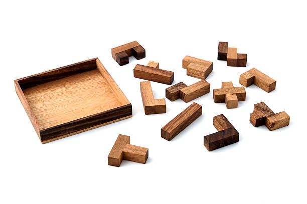

# Pentomino Puzzle Solver

Unlock the charm of the Pentomino Puzzle with this elegant C++ solution. The Pentomino puzzle, a classic in the world of logic puzzles, challenges you to fit 12 pentomino pieces into a 6x10 grid. This project is a C++ program that solves the 6x10 Pentomino puzzle using the Knuth Algorithm X with Doubly Linked Lists, called DLX. It prints out all solutions to the Pentomino puzzle for a NxM rectangular board.

# 
 

## Project Overview

The Pentomino puzzle solver is a fascinating application that demonstrates the power of algorithms in solving complex logic puzzles. The solver is integrated into the `main.cpp` file and takes advantage of modern C++11 features to provide an efficient and elegant solution.

## Getting Started

To get started with the Pentomino Puzzle Solver, follow the steps below:

1. Clone the repository to your local machine using the command `git clone https://github.com/MR-ARMA/Pentomino.git`.
2. Navigate to the directory containing the project files.
3. Compile the C++ code using a C++11 compatible compiler. For example, if you're using g++, you can use the command `g++ -std=c++11 main.cpp -o main`.
4. Run the compiled program using the command `./main`.

## Contributing

Contributions are what make the open source community such an amazing place to learn, inspire, and create. Any contributions you make are greatly appreciated.

1. Fork the Project
2. Create your Feature Branch (`git checkout -b feature/AmazingFeature`)
3. Commit your Changes (`git commit -m 'Add some AmazingFeature'`)
4. Push to the Branch (`git push origin feature/AmazingFeature`)
5. Open a Pull Request

## License

Distributed under the MIT License. See `LICENSE` for more information.

